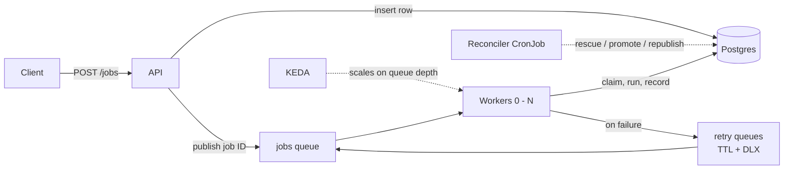

# Summary

A job processing system, built with an aim to learn more about distributed systems and their underlying technologies (using Go, Postgres, RabbitMQ, Kubernetes, KEDA, Prometheus, Grafana).

## How it works

Clients submit jobs and check their progress via a web API (Go). The web API saves submitted jobs to the database (Postgres) and publishes a message containing the job ID to a queue (RabbitMQ). Workers (Go) pick up jobs from the queue and handle them. KEDA autoscales workers according to queue depth. A dedicated reconciler cron job (Go) ensures that the message queue is aligned to the source of truth (e.g. stale/scheduled jobs get published).

A job moves through `scheduled > queued > running > completed | failed`, with failed attempts looping back to `queued` until the attempt budget runs out.

