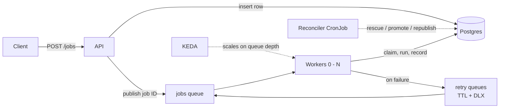

## Summary

A job processing system, built with an aim to learn more about distributed systems and their underlying technologies (using Go, Postgres, RabbitMQ, Kubernetes, KEDA, Prometheus, Grafana).



Clients submit jobs and check their progress via a web API (Go). The web API saves submitted jobs to the database (Postgres) and publishes a message containing the job ID to a queue (RabbitMQ). Workers (Go) pick up jobs from the queue and handle them. KEDA autoscales workers according to queue depth. A dedicated reconciler cron job (Go) ensures that the message queue is aligned to the source of truth (e.g. stale/scheduled jobs get published).

A job moves through `scheduled > queued > running > completed | failed`, with failed attempts looping back to `queued` until the attempt budget runs out.

## Running locally

Requires Docker, k3d, kubectl and helm.

```bash
k3d cluster create jobqueue --agents 2 --api-port 127.0.0.1:6550

helm repo add kedacore https://kedacore.github.io/charts
helm repo add prometheus-community https://prometheus-community.github.io/helm-charts
helm repo update

helm install keda kedacore/keda -n keda --create-namespace --wait

helm install monitoring prometheus-community/kube-prometheus-stack \
  -n monitoring --create-namespace --wait \
  --set alertmanager.enabled=false \
  --set prometheus.prometheusSpec.retention=6h \
  --set prometheus.prometheusSpec.podMonitorSelectorNilUsesHelmValues=false \
  --set prometheus.prometheusSpec.serviceMonitorSelectorNilUsesHelmValues=false

docker build -t distributedjobqueue-api -f cmd/api/Dockerfile .
docker build -t distributedjobqueue-worker -f cmd/worker/Dockerfile .
docker build -t distributedjobqueue-reconciler -f cmd/reconciler/Dockerfile .
k3d image import distributedjobqueue-api distributedjobqueue-worker distributedjobqueue-reconciler -c jobqueue

kubectl apply -f k8s/
kubectl wait --for=condition=available --timeout=180s deployment/api

kubectl port-forward svc/api 8080:8080
```

Submit a burst and watch KEDA scale (`kubectl get pods -w`):

```powershell
./scripts/submit-jobs.ps1
```

Grafana is at `localhost:3000`, login `admin` / `prom-operator`:

```bash
kubectl port-forward -n monitoring svc/monitoring-grafana 3000:80
```

## API

| Route | Purpose |
|---|---|
| `POST /jobs` | Create a job |
| `GET /jobs/{id}` | Current state |
| `GET /jobs/{id}/runs` | Per-attempt history |
| `POST /jobs/{id}/requeue` | Give a failed job a fresh attempt budget |

```json
POST /jobs
{
  "type": "sleep",
  "payload": { "seconds": 5 },         // depends on type
  "max_attempts": 3,                   // optional, default 5
  "priority": 5,                       // optional, 0-5, jumps the queue
  "run_at": "2026-08-01T09:00:00Z"     // optional, schedule for later
}
```

Available demo job types: `sleep`, `cpu`, `flaky`. Job type handlers in `internal/handlers`.

## Behaviour notes

- At-least-once delivery, with idempotent claims
- Workers take a 60s lease when claiming a job and refresh every 20s while running it
- Reconciler cron job running every minute
  - Ensures the message queue and database states align
  - Restores jobs with expired leases so a functional worker can pick them up
  - Publishes scheduled jobs once their time arrives
- Retries with exponential backoff
  - Failed jobs go through TTL + dead letter holding queues (5s > 30s > 2m > 10m > 30m)
- Available workers are scaled to zero when the queue is empty - scaled back up when a message appears
- Per-attempt history / information is persisted in a job_runs table
